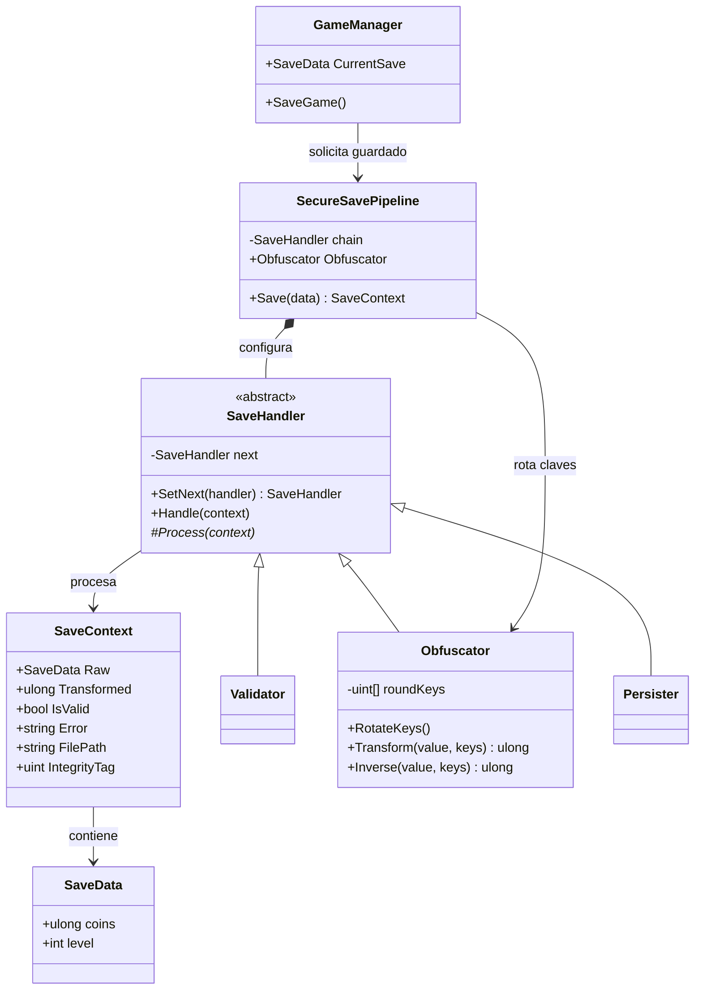
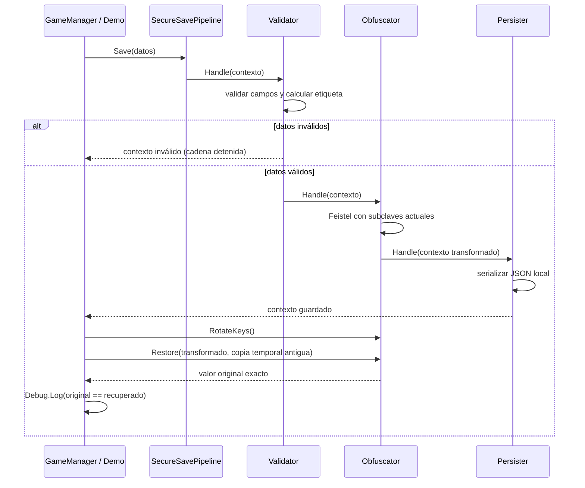

# Guardado seguro con Chain of Responsibility (Unity)

El código completo y la prueba con `Debug.Log` están en [GuardadoSeguroCoR.cs](GuardadoSeguroCoR.cs). Coloca el archivo bajo `Assets/Scripts/` en un proyecto Unity y agrega `SavePipelineDemo` a un GameObject para ejecutar el ejemplo. `Persister` escribe `save.json` dentro de `Application.persistentDataPath`.

La cadena se compone así: `Validator → Obfuscator → Persister`. Si Validator rechaza el contexto, `IsValid` queda en `false` y el resto de la cadena no se ejecuta. `SetNext` devuelve el siguiente eslabón para permitir composición fluida.

La transformación es una red Feistel de ocho rondas sobre un `ulong`; su función de ronda contiene productos y mezclas no lineales. La inversa recorre las rondas en orden inverso, sin conversiones de coma flotante ni pérdida de precisión. Las subclaves aleatorias se regeneran en RAM con `RotateKeys()`.

**Límite importante:** esto es ofuscación, no cifrado seguro. El archivo no se puede recuperar después de cerrar el proceso porque las claves son efímeras y no se guardan. En la demostración, se conserva una copia temporal de las claves antiguas en RAM para verificar el dato después de rotar las claves activas. Para guardados durables que deban sobrevivir reinicios, usa cifrado autenticado y una clave gestionada por una plataforma segura; persistir la clave junto al JSON anula la protección. `IntegrityTag` es una comprobación sencilla de corrupción accidental, no una firma contra manipulación deliberada.

## UML de clases



`GameManager` puede crear `SecureSavePipeline` una vez y llamar a `Save(CurrentSave)`. Por ejemplo:

```csharp
private Juego.Guardado.SecureSavePipeline saves;
private void Awake() => saves = new Juego.Guardado.SecureSavePipeline(
    System.IO.Path.Combine(Application.persistentDataPath, "save.json"));
private void SaveGame() => saves.Save(CurrentSave);
```

## Secuencia de guardado y prueba de rotación


